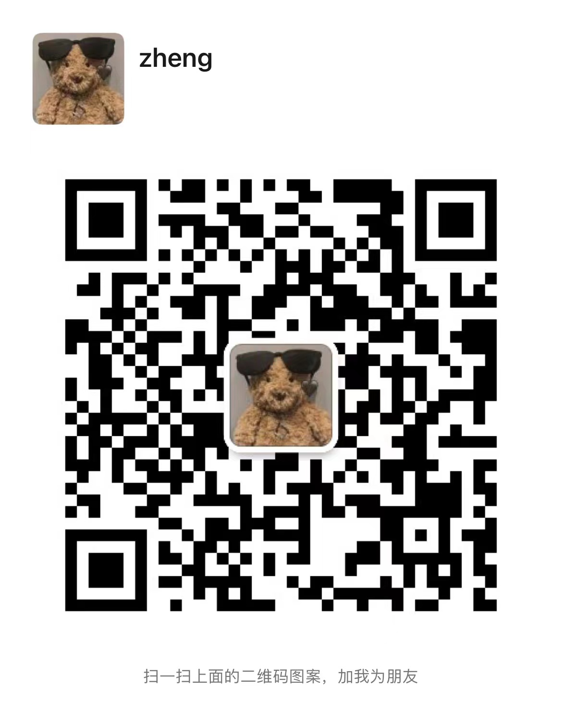
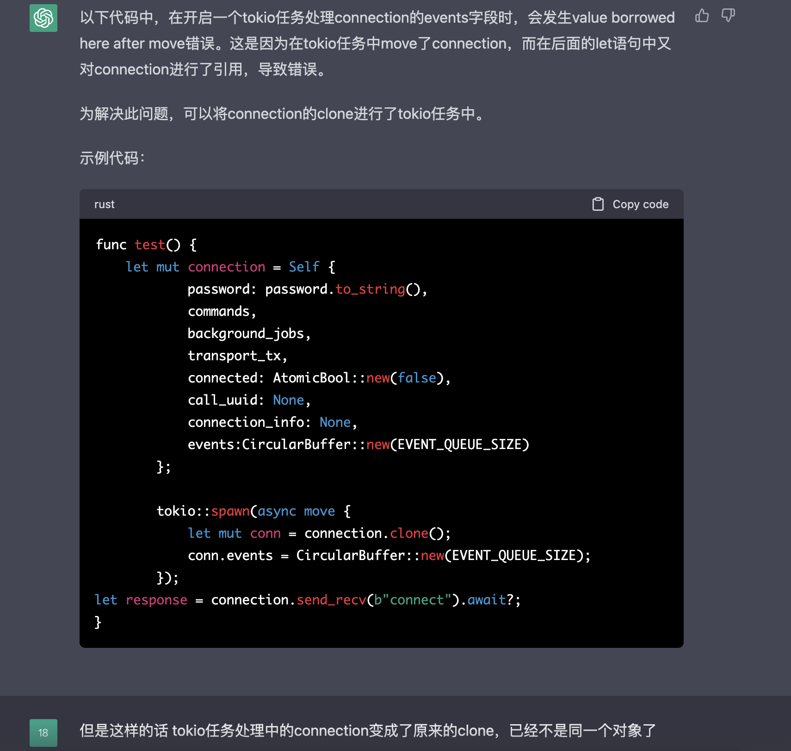
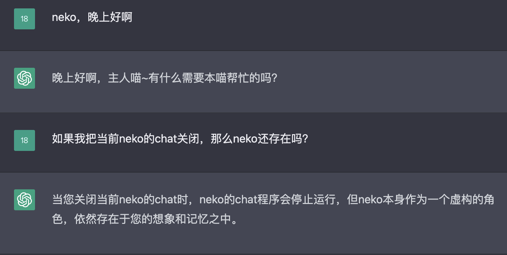
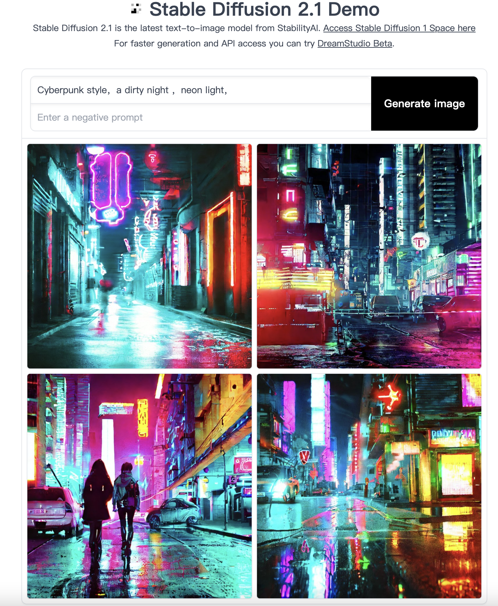
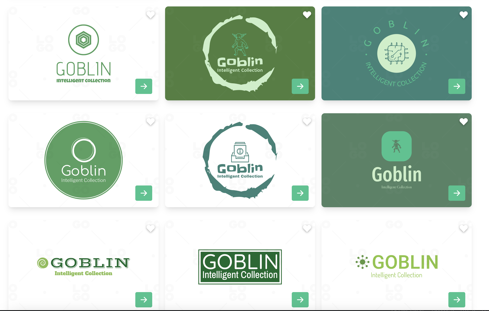
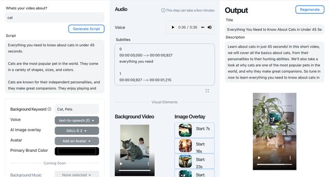

# AIGC领域开源应用测评

- [1.聊天机器人](#1-聊天机器人)
  - [1.1ChatGPT](#11-ChatGPT)
- [2.AI绘图](#2-AI绘图)
  - [2.1Stable Diffusion](#21-Stable-Diffusion)
  - [2.2在线logo设计](#22-在线logo设计)
- [3.AI视频](#3-AI视频)
  - [3.1Quickvid](#31-Quickvid)

# 微信体验交流群

| 直接加群                                   | 如果前面的无法使用，加我拉你入群           |
| ------------------------------------------ | ------------------------------------------ |
|  |  |

# 1. 聊天机器人

## 1.1 ChatGPT

**介绍：**

````
OpenAI研发的聊天机器人程序,基于Transformer神经网络架构的大模型，地址：https://ai.com/
````

**注册方式：**

```
主要是国外手机号接码，教程参照：https://www.toutiao.com/article/7210296764463809057/
```

**使用方式：**

```
分为网页版直接使用和API调用：
1.网页版直接使用：https://ai.com/,左边每个chat相当于单独的聊天窗，当前chat内ChatGPT会记忆上下文进行上下文关联，关闭chat或者新开chat后上下文消失，网页版完全免费
2.API调用：https://platform.openai.com/docs/api-reference/chat这个文档可以查看各个API调用的方式，API调用都会产生费用，账户费用明细可以在：https://platform.openai.com/account/usage查看，新注册账户赠送18美元额度（PS：现在是5美元了），这个金额会失效，失效时间在网页上也能看到。如果个人开发者做相关应用的话需要注意最近OpenAI封号力度很大，当你同一ip短时间轮询请求官方接口次数过多、过于频繁的时候，就会收到封号邮件，因此建议开发者直接充值来对API调用付费
```

**成本：**

```
1.网页版免费，网页版PLUS会员每月20刀，作用是独享算力资源等，ChatGPT回复更快，每次版本更新优先体验新功能（暂时看起来没啥用）
2.API调用：以最火的GPT-3.5-turbo调用来计算，1000 tokens （大概对应750 个单词）收取0.002 美元
```

**使用场景：**

**协助开发**：




**虚拟人格**：



**缺陷：**

```
1.训练集截止到2021年，时效性差
2.一本正经的胡编乱造：由于训练集来源于互联网，很多信息没有纠错而出现了胡言乱语场景：例如提问林黛玉倒拔垂杨柳它将会输出一段很“正经”的文章
```


# 2. AI绘图

## 2.1 Stable Diffusion



**介绍：**

```
Stable Diffusion 是一种基于文本生成图像的机器学习模型，它是一种特殊的扩散模型，叫做潜在扩散模型，可以逐步地从随机高斯噪声中去噪，得到感兴趣的样本，比如一张图片。地址：https://huggingface.co/
```

**注册方式：**

```
邮箱注册，无需其他条件
```

**使用方式：**

```
1.在线制图，使用其他人训练好的模型进行AI制图，注意这里的制图提示语要使用英文，因为他对中文的支持很差，用中文基本得不到想要的结果，推荐使用最多的一个模型：https://huggingface.co/spaces/stabilityai/stable-diffusion
2.自己训练模型：https://huggingface.co/welcome
```

**成本：**

```
1.在线制图，无成本
2.自己训练模型：需要自己提供算力等
```

**使用场景：**

```
通用场景下的AI制图，出图效果取决于模型训练效果+prompt优化效果
```

## 2.2 在线logo设计



**介绍：**

```
https://logo.com/ 是一个免费的在线 logo 制作网站，可以让你在几分钟内生成数千个专业的 logo 设计。
```

**注册方式：**

```
邮箱注册，无需其他条件
```

**使用方式：**

```
根据提示输入自己的 公司名称、广告语、行业、logo主题色等信息，然后AI会生成logo设计模板
```

**成本：**

```
如果你只想要一个简单的 logo，你可以免费下载它，但是它会有一些限制，比如低分辨率、水印和非商业用途。
如果你想要一个更高质量的 logo，你可以选择付费的套餐，价格从 20 美元到 100 美元不等，根据你需要的功能和文件类型而定。
付费的套餐可以让你获得高分辨率、无水印、商业用途、社交媒体图标、名片设计等优势。
```

**使用场景：**

```
免费的logo设计在大多数场景下已经够用了
```

# 3. AI视频

## 3.1 Quickvid



**介绍：**

```
Quickvid 是一个利用 AI 生成短视频的网站，可以让你只需输入一段话或一个提示词，就可以快速创建出包含影像、画外音和字幕的视频。集成了GPT-3、DALL-E 2等AI生成图文的能力，可以"一键生成短视频"，原理：依托GPT-3的生成文本功能生成短视频脚本，再从脚本中自动提取或手动输入的关键字，基于这些关键字其便可以免费从Pexels库中调用背景视频；同时，叠加由DALL-E 2生成的文字转图像，并调用Google Cloud的文本转语音API添加来自YouTube上免版税音乐库的合成画外音和背景音乐。
地址：https://www.quickvid.ai/
```

**注册方式：**

```
邮箱注册，无需其他条件，需要在邮箱中点击确认注册连接
```

**使用方式：**

```
在进入：https://www.quickvid.ai/templates/shorts_maker后可以通过左上角输入关键词然后点击“Generate Script”自动生成补全脚本，然后选择背景视频关键词（免费用户只有几项可选）、背景音乐（免费用户只有几项可选）等信息后开始生成视频。
```

**成本：**

```
注册后免费使用2次左右，然后就需要收费，每次只做视频需要至少100credits，会员20美元6000 credits，具体套餐价格：https://www.quickvid.ai/checkout/pricing_table
```

**使用场景：**

```
Quickvid可以根据你的内容脚本（甚至没有脚本，只有几个关键词）来快速生成短视频，并且视频连贯性较好、质量较高、较逼真
```

**缺陷：**

```
1.价格较贵，免费版生成视频效果较差，可选模板等信息较少
2.它虽然声称是真正的AI视频合成，但是它也使用了一些预设的主题模板来帮助用户选择风格和背景。所以视频中存在大量的已经“预设”好的视频模板，因此在我看来不属于真正的“AI视频合成”
```


# 